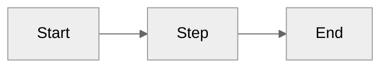
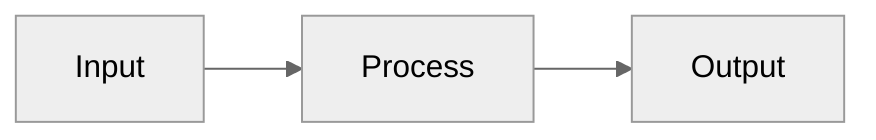

## Claude/Cursor Guide for Slidev Presentations

This guide defines how AI assistants (Claude, Cursor) should create and maintain Slidev decks in this repository, aligned with our workspace rules and design standards.

---

## Golden Rules

- **All new decks live under `presentations/`**. Use the project scripts, not ad‑hoc commands.
- **Plan first**. Create `presentation-plan.txt` in the deck and populate it using `presentation-plan-template.txt`.
- **Split slides**. Keep content modular in `slides/` and import them into `slides.md` with `src:`.
- **Design for clarity**. Constrain content to prevent overflow, use visual hierarchy, and test at multiple sizes.
- **Reveal strategically**. Prefer section reveals over over‑animating bullet items.

---

## Project Setup (scripts)

Use the root scripts. Examples use npm; pnpm/yarn also work.

```bash
# Interactive menu (recommended)
npm run menu

# Create a new presentation
npm run create -- "Your Presentation Name"

# Run a specific presentation
npm run run -- <presentation-name>

# List available presentations
npm run list

# Export all presentations (PDF)
npm run export-all
```

Per‑deck commands (inside a presentation directory):

```bash
# Start the dev server for that deck
pnpm slidev

# Export formats
pnpm slidev export           # prompt for format
pnpm export:pdf              # if provided by the deck
pnpm export:png              # if provided by the deck
```

---

## Repository & Deck Structure

- `presentations/` — one folder per deck
- `components/` — shared Vue components for all decks
- `scripts/` — helper scripts for creation/run/export
- `docs/` — local documentation (`slidev-best-practices.md`)
- `images/` — shared image assets

Typical deck layout:

```
presentations/my-presentation/
├─ slides.md                 # headmatter + slide imports
├─ slides/                   # split slides for modularity
│  ├─ 01-intro.md
│  ├─ 02-problem.md
│  └─ …
├─ assets/                   # deck-specific images/diagrams/code
└─ package.json              # deck scripts
```

---

## New Presentation Checklist

1. Create the deck with the project script (see Project Setup).
2. Add a `presentation-plan.txt` to the new deck by copying from `presentation-plan-template.txt` and fill it out.
3. In `slides.md`, define global headmatter and make it your opening slide:

```yaml
---
theme: default
title: Your Presentation Title
transition: slide-left
lineNumbers: true
fonts:
  sans: Montserrat, Roboto
highlighter: shiki
---
```

4. Create a `slides/` directory and split content into small files.
5. Import slides back into `slides.md` using `src:` blocks:

```md
---
src: ./slides/01-intro.md
---

---
src: ./slides/02-problem.md
---
```

---

## Slide Design Principles (placement, spacing, flow)

- **Keep it short**
  - 4–5 bullets per slide, 5–7 words each
  - Prefer multiple slides over dense content

- **Layout patterns**
  - Two‑column grid:

```md
---
layout: default
---
# Two Column

<div class="grid grid-cols-1 md:grid-cols-2 gap-4 items-start">
  <div>
    ## Left
    - Point A
    - Point B
  </div>
  <div>
    ## Right
    - Point C
    - Point D
  </div>
</div>
```

- **Responsive spacing**
  - Use `p-2 sm:p-3 md:p-4` for safe padding
  - Keep ~10% margins around content

- **Typography hierarchy**
  - Titles: `text-2xl` – `text-4xl` (sparingly)
  - Body: `text-base` – `text-lg`
  - Captions: `text-xs` – `text-sm`
  - Add `leading-tight` to reduce line spacing when needed

- **Images & media**
  - Center images and constrain height

```md
---
layout: center
---
# Image Example

<div class="flex justify-center">
  
  
</div>
```

- **Code slides**
  - Use line highlights to stage focus

```ts {2-3|5|all}
function example() {
  const value = computeSomething()
  
  return value
}
```

- **Diagrams (Mermaid)**
  - Prefer `graph LR` (left‑right)
  - Limit to 5–7 nodes; short labels
  - Set `scale: 0.7` or `0.8`



- **Reveals & pacing**
  - Use `<v-click>` to reveal groups of content
  - Avoid animating every bullet; reveal sections

---

## AI Authoring Rubric (choose layout, theme, and density)

- Intent first (pick one):
  - Title/Cover → `layout: cover` (or theme `intro`)
  - Section/Agenda → `layout: section`
  - List/Text → `layout: default` with `max-w-3xl space-y-2 text-lg`
  - Comparison → two‑column grid (`grid grid-cols-1 md:grid-cols-2 gap-4 items-start`)
  - Image‑heavy → `layout: center` or two‑column with image and caption
  - Code Focus → `layout: default` with ≤ 16 visible lines, add highlights
  - Diagram → Mermaid `graph LR`, ≤ 7 nodes, short labels
  - Quote/Statement → `layout: quote`

- Theme selection (pick for the talk style):
  - Minimal/corporate: `apple-basic`
  - Playful/creative: `bricks`
  - Editorial/long‑form: `seriph`
  - Brandable/dark+light: `penguin`
  - If uncertain, start with `default` and only switch when a theme‑specific layout is required (e.g., `image-right`).

- Density guardrails (enforce to avoid overflow):
  - Bullets: max 4–5 per slide, 5–7 words each
  - Columns: max 4 bullets per column
  - Code: show ≤ 16 lines; if > 16, split across steps or slides; highlight critical lines
  - Diagram: ≤ 7 nodes; prefer LR layout
  - If a slide exceeds any limit, split into multiple slides or add `<v-clicks>` reveals

- Responsive classes to keep content inside the safe area:
  - Spacing: `p-2 sm:p-3 md:p-4`, `space-y-2`
  - Width: `max-w-3xl mx-auto`
  - Typography: `text-base md:text-lg leading-tight`

- Patterns (copy/paste):

Two‑column comparison

```md
---
layout: default
---
<div class="grid grid-cols-1 md:grid-cols-2 gap-4 items-start">
  <div>
    ### Pros
    <v-clicks>
    - Simple
    - Fast
    - Flexible
    </v-clicks>
  </div>
  <div>
    ### Cons
    <v-clicks>
    - Limited
    - Learning curve
    - Maintenance
    </v-clicks>
  </div>
  
</div>
```

Image right, text left (theme‑agnostic)

```md
---
layout: default
---
<div class="grid grid-cols-1 md:grid-cols-2 gap-4 items-center">
  <div class="space-y-2">
    # Headline
    - Key point 1
    - Key point 2
    - Key point 3
  </div>
  <div class="flex justify-center">
    
  </div>
</div>
```

Code with staged focus

```ts {1,4-6|2-3|all}
export function compute(value: number): number {
  const normalized = normalize(value)
  const validated = validate(normalized)
  // heavy work
  const result = runAlgorithm(validated)
  return result
}
```

Mermaid small diagram



---

## Testing & Export

- Test at 640px, 1024px, 1536px
- Presenter Mode (`P`) to check overflow and notes
- Overview (`O`) to assess pacing

```bash
# Export a deck to PDF/PNG
pnpm slidev export

# Build static site (SPA)
pnpm slidev build
```

---

## Quick Patterns (copy/paste)

### Section Divider
```md
---
layout: section
---
# New Section
```

### Quote
```md
---
layout: quote
---
"A short statement that stands out on its own."

<footer>Attribution</footer>
```

---

## References

- Local: `docs/slidev-best-practices.md`
- Slidev docs: [sli.dev](https://sli.dev)
- Theme gallery: [sli.dev/themes](https://sli.dev/themes)

Follow the workspace rules for slide styling, planning, and creation. When in doubt, split the slide, reduce text, and test responsiveness.