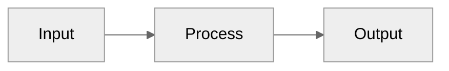

# Slidev Presentation Guide – Best Practices & Theme Usage

> Concise, opinionated guidance for teams creating Slidev decks in this repo. Everything here comes directly from the official Slidev documentation and examples already living in the `presentations/` folder – no assumptions added.

---

## 1. Project Setup

1. **Create a deck** (one‑off)
   ```bash
   pnpm create slidev   # or  npm init slidev@latest / yarn create slidev
   ```
2. **Start the dev‑server**
   ```bash
   pnpm slidev  # opens http://localhost:3030 with hot‑reload
   ```
3. The entry file defaults to `slides.md` but can be renamed/passed to the CLI.

---

## 2. Recommended File Structure

```
└─ presentations/
   └─ my-presentation/
      ├─ slides.md           # the headmatter and high‑level slides
      └─ slides/             # individual pages imported with `src:`
         ├─ 01-intro.md
         ├─ 02-problem.md
         └─ …
```

### Why split slides?
* **Re‑usability** – mix & match sections between decks.
* **Git hygiene** – smaller diffs, easier reviews.
* **Focus** – work on a single slide without scrolling large files.

To include an external slide just point the `src:` front‑matter to the file:
```md
---
src: ./slides/02-problem.md
---
```
Slidev will inline the referenced markdown in place.

---

## 3. Front‑matter Cheatsheet

Place a **head‑matter** block at the top of `slides.md` to configure the whole deck and **front‑matter** blocks at the top of individual slides.

```yaml
---
# Head‑matter (deck‑wide)
layout: cover        # default layout
theme: bricks        # see §5
background: '#121212'
class: text-white
fonts:
  sans: Montserrat, Roboto
highlighter: shiki
lineNumbers: true
---
```

Important per‑slide keys:
* `layout`: `default | center | section | intro …` (varies by theme)
* `class`: utility classes (UnoCSS / Tailwind syntax)
* `background`: color, image url or number (theme‑specific)
* `src`: path to an external slide file (multi‑page support)

---

## 4. Keeping Content Inside the Page

Slidev auto‑scales text but the following tips help avoid overflow:

| Technique | When to use | Example |
|-----------|-------------|---------|
| **Layouts** | Large blocks of content | `---\nlayout: center\n---` centres & constrains width |
| **Stacks**  | Progressive bullet reveals | `::next::` split content into steps |
| **Grid / Flex** | Two‑column comparisons | `<div class="grid grid-cols-2 gap-4">…` |
| **Utility classes** | Fine‑tune spacing | `mb-4 text-sm` |
| **Fragments** | Break code snippets | ```ts {2-4}``` highlight only lines 2‑4 |

> Tip: enable **Presenter Mode** (`P` while presenting) to preview overflow live.

---

## 4.1 Layout Decision Matrix (pick the right layout fast)

- **Cover / Title**: `layout: cover` (or theme `intro`)
- **Agenda / Section**: `layout: section`
- **Simple text list**: `layout: default` + `max-w-3xl mx-auto space-y-2`
- **Comparison**: two‑column grid (`grid grid-cols-1 md:grid-cols-2 gap-4 items-start`)
- **Image focus**: `layout: center` or two‑column text+image
- **Code focus**: `layout: default`, ≤ 16 lines visible, use highlights
- **Diagram**: Mermaid `graph LR`, ≤ 7 nodes, short labels
- **Quote**: `layout: quote`

Density guardrails:
- Bullets: max 4–5 per slide, 5–7 words each
- Per column: ≤ 4 bullets
- Code: ≤ 16 lines on screen; split or stage reveals beyond that
- Diagram: ≤ 7 nodes; keep labels short

If any guardrail is exceeded → split the slide or use `<v-clicks>` to reveal groups.

Responsive helpers:
- Spacing: `p-2 sm:p-3 md:p-4`, `space-y-2`
- Width: `max-w-3xl mx-auto`
- Typography: `text-base md:text-lg leading-tight`

---

## 5. Theme Selection Guide

| Theme | Visual style | Ideal for | Notable layouts/components |
|-------|--------------|-----------|---------------------------|
| **bricks** | Playful polygons & vibrant colours | Creative, informal tech talks | `cover`, `items`, `<Polygon1‑11/>` |
| **penguin** | Brand‑centric, dark & light variants | Personal branding, conferences with sponsor footer | `intro`, `presenter`, `text‑image`, `fancy-link` |
| **apple-basic** | Minimal, Keynote‑like black/white | Corporate or clean design‑first slides | `intro`, `image-right`, `fact`, `quote` |
| **seriph** | Serif typography, editorial look | Academic or long‑form story telling | Wide set of standard layouts |

### Switching themes
Just change the `theme:` value in the deck head‑matter. The first dev reload will prompt to install missing theme packages automatically.

```yaml
---
theme: penguin
---
```

If a theme requires extra Vite plugins (e.g. `penguin` needs `vite-svg-loader`) follow its README; add them to `vite.config.ts` at the deck root.

---

## 6. Export & Hosting

```bash
pnpm slidev export        # pdf, pptx, pngs (see prompts)
pnpm slidev build         # static SPA in dist/
```
Upload the `dist/` folder to any static host (Netlify, Vercel, GitHub Pages).

---

## 7. Quick Recipes

### Two‑column comparison slide
```md
---
layout: default
---
<div class="grid grid-cols-2 gap-6">

### Pros

- Simple
- Fast

### Cons

- Limited
- Manual upkeep

</div>
```

### Image background with centred text
```md
---
layout: center
background: /images/bg.jpg
class: text-white
---

# Big Message
```

### Text + Image (right)
```md
---
layout: default
---
<div class="grid grid-cols-1 md:grid-cols-2 gap-4 items-center">
  <div class="space-y-2">
    # Headline
    - Point 1
    - Point 2
    - Point 3
  </div>
  <div class="flex justify-center">
    
  </div>
</div>
```

### Code with highlights (≤ 16 lines)
```ts {1,4-6|2-3|all}
export function compute(value: number): number {
  const normalized = normalize(value)
  const validated = validate(normalized)
  const result = runAlgorithm(validated)
  return result
}
```

### Mermaid small diagram (≤ 7 nodes)


---

Happy Slide‑ding! 🎉 