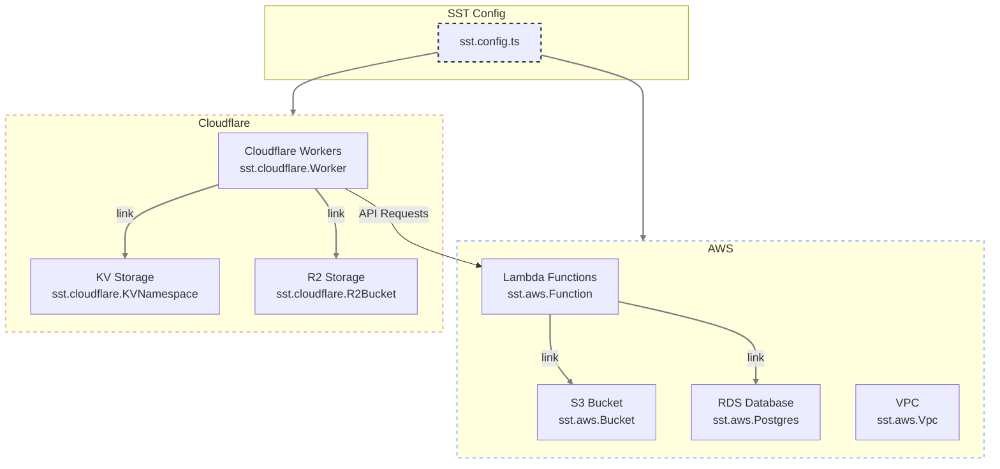

# Multi-Cloud Architecture with SST

  AWS + 
  Cloudflare = 
  Best of Both Worlds

  Note: With SST, you can define and manage resources across multiple cloud providers in the same configuration file, creating truly multi-cloud applications.

 