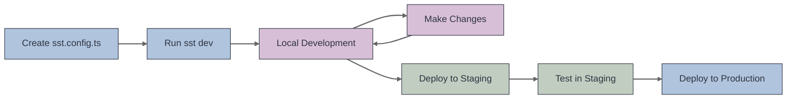

# SST Development Workflow

## Local Development
- Run `sst dev` to start development
- Changes are reflected instantly
- Functions run locally but access cloud resources
- No need to deploy for testing

## Deployment
- Stage-based deployments
- Personal stages for development
- Shared stages for testing
- Production stage for live environment
- One command: `sst deploy --stage production`

 