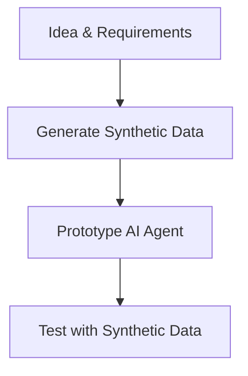
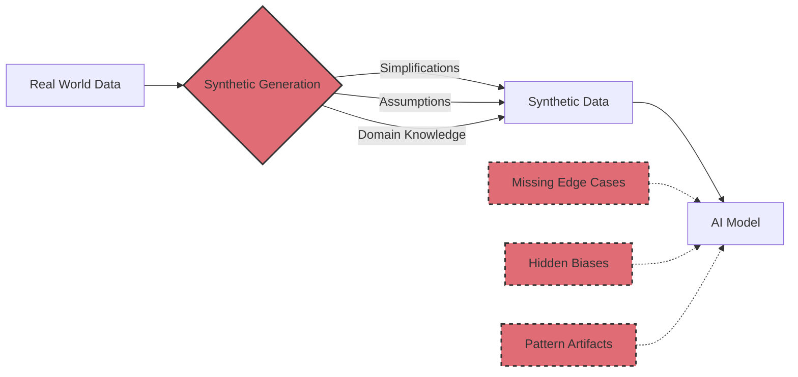
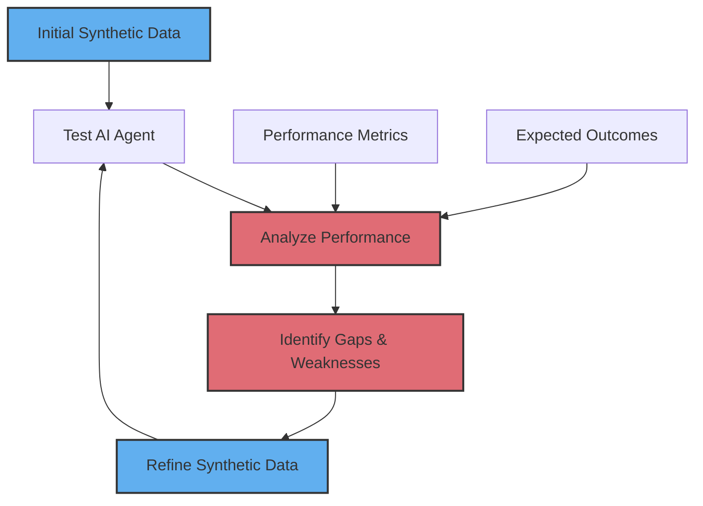
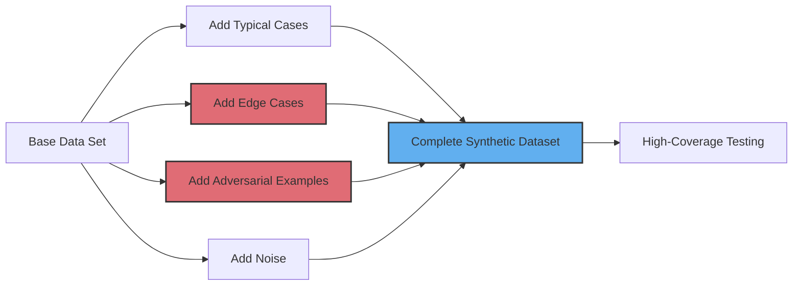

# Synthetic Data for Testing

<div class="text-gray-300 font-light">How to think about, create, and leverage artificial data for AI testing</div>

<div class="pt-12">
  <span @click="$slidev.nav.next" class="px-2 py-1 rounded cursor-pointer bg-white text-black" hover="bg-opacity-90">
    Press Space for next page <carbon:arrow-right class="inline"/>
  </span>
</div>

<div class="abs-br m-6 flex gap-2">
  <a href="https://github.com/yourusername/synthetic-data-guide" target="_blank" alt="GitHub" title="View on GitHub" class="text-xl slidev-icon-btn opacity-70 !border-none !hover:text-white">
    <carbon-logo-github />
  </a>
</div>

<style>
h1 {
  color: #E06C75;
}
</style>

---

# What is Synthetic Data?

<div class="grid grid-cols- gap-4 mt-4">
<div>

- Artificially generated information that mimics real-world data
- Created without exposing sensitive information
- Designed to train AI models safely and efficiently
- Transformative resource for modern AI development

</div>
<div>


</div>
</div>

<style>
h1 {
  color: #E06C75;
}
</style>

---

# Technical Benefits of Synthetic Data

<div class="grid grid-cols gap-4 mt-4">
<div>

## Key Advantages
- Privacy preservation for sensitive information
- Scalability to produce vast tailored datasets
- Control over variables and edge cases
- Cost efficiency compared to manual data collection
- Bias mitigation through balanced representation

</div>
<div>


</div>
</div>

<div class="mt-4 text-sm text-gray-400">
  <em>Suggested visual: A comparison chart showing traditional data collection vs. synthetic data generation with metrics for cost, time, privacy risk, and scalability</em>
</div>

<style>
h1 {
  color: #E06C75;
}
h2 {
  color: #61AFEF;
}
</style>

---

# Business & Operational Advantages

<div class="grid grid-col gap-4 mt-4">
<div>

## Strategic Value
- Faster prototyping and development cycles
- Reduced risks during testing and implementation
- Enhanced model robustness across varied conditions
- Regulatory readiness and compliance
- Competitive advantage through faster time-to-market

</div>
<div>


</div>
</div>

<div class="mt-4 text-sm text-gray-400">
  <em>Suggested visual: Timeline comparison showing traditional vs. synthetic data-powered development cycle with key milestones and time savings highlighted</em>
</div>

<style>
h1 {
  color: #E06C75;
}
h2 {
  color: #61AFEF;
}
</style>

---

# Synthetic Data for AI Agent Testing

<div class="grid grid-cols-2 gap-4 mt-4">
<div>

## Prototyping AI Agents
- Enable rapid prototyping without real user data
- Test current assumptions in controlled environment
- Validate agent interaction patterns early
- Reduce development cycles with simulated feedback
- Identify edge cases before production deployment

</div>
<div>



</div>
</div>

<style>
h1 {
  color: #E06C75;
}
h2 {
  color: #61AFEF;
}
</style>

---

# Limitations of Synthetic Data

<div class="p-4 bg-red-900 bg-opacity-20 rounded-lg border-l-4 border-red-500">
  <div class="font-bold text-red-400">Understanding the Boundaries</div>
  <div class="text-gray-300">
    While powerful, synthetic data brings its own challenges we must navigate
  </div>
</div>

<div class="grid grid-cols-2 gap-4 mt-4">
<div>

## Real-World Constraints
- May not fully capture real-world complexity
- Based on assumptions that can introduce biases
- Requires domain expertise to generate meaningfully
- Risk of overfitting to synthetic patterns
- Less effective for rare, unusual scenarios

</div>
<div>



</div>
</div>

<style>
h1 {
  color: #E06C75;
}
h2 {
  color: #61AFEF;
}
</style>

---

# Task-Specific vs Generic Synthetic Data

<div class="p-4 bg-green-900 bg-opacity-20 rounded-lg border-l-4 border-green-500 mb-4">
  <div class="font-bold text-green-400">Best Practice</div>
  <div class="text-gray-300">
    "Build high-specificity tooling that users care about"
  </div>
</div>

<div class="grid grid-cols-2 gap-4 mt-4">
<div>

## High-Specificity Approach ✅
- Generate synthetic data for concrete user tasks
- Focus on specific business outcomes
- Model real user interactions in controlled ways
- Create artificial test cases for specific edge cases
- Design synthetic data with clear evaluation criteria
- Example: AI meeting preparation assistant with specific Q&A tests

</div>
<div>

## The "No Superpowers" Trap ⚠️
- Building generic solutions for broad problems
- "Search all personal data" vs. "Meeting preparation tool"
- Attempting to cover all possible cases
- No clear mapping between tests and user value
- Feature-focused rather than outcome-driven
- Impossible to create comprehensive synthetic data
- Lacks concrete benchmarks for success

</div>
</div>

<div class="mt-4 bg-gray-800 p-3 rounded-lg">
  <div class="text-center text-yellow-400 font-bold mb-1">Remember: Focus on Outcomes, Not Features</div>
  <div class="text-center text-gray-300">
    Synthetic data should model specific use cases that deliver concrete value, not attempt to test every possible scenario
  </div>
</div>

<style>
h1 {
  color: #E06C75;
}
h2 {
  color: #61AFEF;
}
</style>

---

# Business Applications: SQL Query Generation

<div class="grid grid-cols-2 gap-4 mt-4">
<div>

## Database Query Synthesis
- Generate synthetic queries for unique business logic
- Create variations of base queries for testing
- Validate SQL agent capabilities across query types
- Test performance against a variety of synthetic queries
- Identify patterns that trigger unexpected behavior

</div>
<div>

```sql
-- Base Query Template
SELECT customer_id, 
       SUM(order_total) as total_spent
FROM orders
WHERE order_date BETWEEN :start_date AND :end_date
GROUP BY customer_id
HAVING total_spent > 1000
ORDER BY total_spent DESC
LIMIT 10;

-- Synthetically Generated Variations
-- 1. Add filters
-- 2. Join additional tables
-- 3. Change aggregations
-- 4. Add complex conditions
```

</div>
</div>

<style>
h1 {
  color: #E06C75;
}
h2 {
  color: #61AFEF;
}
</style>

---

# Data Iteration Process

<div class="grid grid-cols-2 gap-4 mt-4">
<div>

## Iterative Refinement
- Start with basic synthetic dataset
- Test AI agent against initial data
- Analyze performance and identify gaps
- Refine synthetic data to address weaknesses
- Repeat until performance meets expectations
- Gradually introduce real-world complexity

</div>
<div>



</div>
</div>

<style>
h1 {
  color: #E06C75;
}
h2 {
  color: #61AFEF;
}
</style>

---

# The Synthetic Data Flywheel

<div class="p-4 bg-blue-900 bg-opacity-20 rounded-lg border-l-4 border-blue-500 mb-4">
  <div class="font-bold text-blue-400">Key Concept</div>
  <div class="text-gray-300">
    "Kickstart the Data Flywheel: Fake it till you make it"
  </div>
</div>

<div class="grid grid-col gap-4 mt-4">
<div>

## The Continuous Improvement Cycle
- Begin with synthetic data for fast testing
- Establish review processes before real data
- Create evaluation frameworks for objective assessment
- Collect and classify real-world examples 
- Improve system based on concrete findings
- Monitor outcomes with leading metrics
- Accelerate development through controlled testing

</div>
<div>


</div>
</div>

<style>
h1 {
  color: #E06C75;
}
h2 {
  color: #61AFEF;
}
</style>

---

# Data Diversity Strategy

<div class="grid grid-cols-2 gap-4 mt-4">
<div>

## Creating Robust Test Sets
- Too high accuracy suggests insufficient diversity
- Intentionally include edge cases and outliers
- Vary complexity levels to test boundaries
- Include both expected and unexpected input patterns
- Create adversarial examples to test limits
- Simulate real-world noise and imperfections

</div>
<div>



</div>
</div>

<style>
h1 {
  color: #E06C75;
}
h2 {
  color: #61AFEF;
}
</style>

---

# Avoiding Common Pitfalls

<div class="grid grid-cols-2 gap-4 mt-4">
<div>

## Absence Blindness
<div class="p-3 bg-gray-800 rounded-lg mb-4">
  <div class="text-yellow-400 font-bold">Problem:</div>
  <div class="text-white">"You don't fix what you can't see"</div>
</div>

### What Teams Often Miss:
- Gaps in synthetic data coverage
- Missing edge cases or rare scenarios
- Hidden biases in test dataset
- Scenarios where model silently fails
- Problems in data pre-processing
- Unaddressed data representation issues

</div>
<div>

## Intervention Bias
<div class="p-3 bg-gray-800 rounded-lg mb-4">
  <div class="text-yellow-400 font-bold">Problem:</div>
  <div class="text-white">"You try to do things to feel in control"</div>
</div>

### Common Mistakes:
- Tweaking model parameters without data analysis
- Overfitting to specific test examples
- Focusing on surface-level improvements
- Making changes based on vague feedback ("looks better")
- Prioritizing complex solutions over data quality
- Reactive changes instead of systematic improvement

</div>
</div>

<div class="mt-4 text-center text-red-400">
  <em>Combat these issues with systematic synthetic data generation and objective evaluation frameworks</em>
</div>

<style>
h1 {
  color: #E06C75;
}
h2 {
  color: #61AFEF;
}
</style>

---

# The Danger of Vague Metrics

<div class="p-4 bg-red-900 bg-opacity-20 rounded-lg border-l-4 border-red-500 mb-4">
  <div class="font-bold text-red-400">Warning Signs</div>
  <div class="text-gray-300">
    Subjective assessments lead to stalled progress and wasted effort
  </div>
</div>

<div class="grid grid-cols-2 gap-4 mt-4">
<div>

## The "Feels Right" Trap
- "This looks better" without quantifiable evidence
- "I don't like how this feels" without specifics
- Relying on gut instinct over measurement
- Inconsistent evaluation criteria across tests
- Inability to reproduce improvement decisions
- No way to track progress systematically

</div>
<div>

</div>
</div>

<div class="flex justify-center mt-6">
  <div class="bg-yellow-900 bg-opacity-30 rounded-lg p-4 max-w-2xl">
    <div class="flex items-center">
      <span class="text-3xl mr-3">⚠️</span>
      <span class="text-yellow-300 font-bold">Without concrete metrics, teams build synthetic data that "looks good" but doesn't drive improvement</span>
    </div>
  </div>
</div>

<style>
h1 {
  color: #E06C75;
}
h2 {
  color: #61AFEF;
}
</style>

---

# Unactionable Feedback: The Silent Killer

<div class="grid grid-cols-2 gap-4 mt-4">
<div>

## Dead-End Evaluation Patterns
- Reviews focused on generation quality before establishing retrieval evaluation
- Collecting data that doesn't translate to specific improvements
- "Vibes translation" remains largely unsolved
- Feedback that doesn't connect to clear next actions
- Looking at test results without creating recommendations
- Metrics that don't guide decision-making

</div>
<div>

<div class="flex flex-col gap-4">
  <div class="bg-gray-800 rounded p-4 border-l-4 border-red-500 flex items-center">
    <div class="text-2xl mr-3">❌</div>
    <div>
      <div class="text-red-400 font-bold">Generation Focus</div>
      <div class="text-sm text-gray-300">Obsessing over output quality before fixing retrieval issues</div>
    </div>
  </div>
  
  <div class="bg-gray-800 rounded p-4 border-l-4 border-red-500 flex items-center">
    <div class="text-2xl mr-3">❌</div>
    <div>
      <div class="text-red-400 font-bold">Disconnected Analysis</div>
      <div class="text-sm text-gray-300">Looking at data without generating specific action items</div>
    </div>
  </div>
  
  <div class="bg-gray-800 rounded p-4 border-l-4 border-green-500 flex items-center">
    <div class="text-2xl mr-3">✅</div>
    <div>
      <div class="text-green-400 font-bold">Action-Oriented Testing</div>
      <div class="text-sm text-gray-300">Every test yields specific, measurable improvements</div>
    </div>
  </div>
</div>

</div>
</div>

<div class="absolute bottom-10 left-10 text-xl text-red-400 italic">
  "After looking at the data, you're supposed to then take action"
</div>

<style>
h1 {
  color: #E06C75;
}
h2 {
  color: #61AFEF;
}
</style>

---

# Disappointed Leadership & Sad Developers

<div class="p-4 bg-blue-900 bg-opacity-20 rounded-lg border-l-4 border-blue-500 mb-4">
  <div class="font-bold text-blue-400">The Human Impact</div>
  <div class="text-gray-300">
    When synthetic data testing lacks structure, the entire team suffers
  </div>
</div>

<div class="grid grid-cols-2 gap-4 mt-4">
<div>

## The Cycle of Frustration
- Leadership expects demonstrable progress
- Developers struggle with vague requirements
- Testing produces inconclusive results
- Everyone feels "something's wrong" but can't articulate it
- Deadlines approach with uncertain quality
- Team morale suffers from lack of clear wins
- Project velocity decreases over time

</div>
<div>

<div class="flex flex-col items-center justify-center h-full">
  <div class="text-6xl mb-4">😞 → 🤔 → 😤</div>
  <div class="text-center text-gray-300 italic">
    "We're testing but not improving... <br>
    We're working but not progressing..."
  </div>
  <div class="mt-4 p-3 bg-gray-800 rounded-lg border border-yellow-500">
    <span class="text-yellow-400 font-bold">Solution:</span> 
    <span class="text-white">Structured synthetic testing with clear metrics and actionable outcomes</span>
  </div>
</div>

</div>
</div>

<style>
h1 {
  color: #E06C75;
}
h2 {
  color: #61AFEF;
}
</style>

---

# Prompt Enhancement with Examples

<div class="p-4 bg-green-900 bg-opacity-20 rounded-lg border-l-4 border-green-500 mb-4">
  <div class="font-bold text-green-400">Technique Spotlight</div>
  <div class="text-gray-300">
    Using synthetic examples in prompts to guide AI behavior
  </div>
</div>

<div class="grid grid-cols-2 gap-4">
<div>

## Benefits of Example Augmentation
- Shape expected output format and style
- Demonstrate desired reasoning approach
- Set performance expectations with examples
- Improve accuracy by showing edge cases
- Reduce ambiguity in complex scenarios

</div>
<div>

```js
// Without Example
"Generate SQL for finding top customers"

// With Synthetic Example
"Generate SQL for finding top customers.
Example:
Input: Find customers who spent over $1000 last month
Output: SELECT customer_id, name, 
  SUM(order_total) as total_spent
FROM orders JOIN customers USING(customer_id)
WHERE order_date >= DATE_SUB(CURDATE(), INTERVAL 1 MONTH)
GROUP BY customer_id, name
HAVING total_spent > 1000
ORDER BY total_spent DESC;"
```

</div>
</div>

<style>
h1 {
  color: #E06C75;
}
h2 {
  color: #61AFEF;
}
</style>

---

# Evaluation Framework

<div class="grid grid-cols-2 gap-4 mt-4">
<div>

## Measuring Synthetic Testing Effectiveness
- Define clear success metrics before testing
- Compare performance across synthetic vs real data
- Track accuracy improvement over iterations
- Measure generalization to unseen scenarios
- Balance quantitative metrics with qualitative assessment
- Document unexpected behaviors for future improvement

</div>
<div>


</div>
</div>

<style>
h1 {
  color: #E06C75;
}
h2 {
  color: #61AFEF;
}
</style>

---

# Leading vs Lagging Metrics

<div class="p-4 bg-purple-900 bg-opacity-20 rounded-lg border-l-4 border-purple-500 mb-4">
  <div class="font-bold text-purple-400">Measurement Strategy</div>
  <div class="text-gray-300">
    Prioritize metrics that drive future improvement, not just document past performance
  </div>
</div>

<div class="grid grid-cols-2 gap-4 mt-4">
<div>

## Leading Metrics (Process-Focused)
- **Number of hypotheses tested per week**
- Diversity of synthetic test cases created
- Coverage of edge cases in test data
- Retrieval precision in synthetic scenarios
- Time to identify data quality issues
- **Actionable insights per testing cycle**

</div>
<div>

## Lagging Metrics (Outcome-Focused)
- Overall model accuracy
- Production system performance
- End-user satisfaction scores
- Time saved in production
- "Looks good to me" assessments
- **Remember**: Focusing only on lagging metrics leads to "absence blindness" — you can't fix what you can't see

</div>
</div>

<div class="mt-4 text-center text-gray-400">
  <em>"Focus on increasing hypotheses tested per week rather than nebulous quality goals."</em>
</div>

<style>
h1 {
  color: #E06C75;
}
h2 {
  color: #61AFEF;
}
</style>

---
layout: center
class: text-center
---

# Thank You!

<div class="text-gray-400 text-xl mt-4">
  Start your synthetic data journey today
</div>

<div class="grid grid-cols-3 gap-8 mt-12">
  <div class="flex flex-col items-center">
    <div class="text-6xl mb-4">🧪</div>
    <div class="font-bold text-blue-400">Experiment</div>
    <div class="text-sm text-gray-400">Start small and iterate</div>
  </div>
  
  <div class="flex flex-col items-center">
    <div class="text-6xl mb-4">🔄</div>
    <div class="font-bold text-green-400">Iterate</div>
    <div class="text-sm text-gray-400">Refine based on results</div>
  </div>
  
  <div class="flex flex-col items-center">
    <div class="text-6xl mb-4">🚀</div>
    <div class="font-bold text-purple-400">Scale</div>
    <div class="text-sm text-gray-400">Expand your synthetic data strategy</div>
  </div>
</div>

<div class="absolute bottom-10 left-0 right-0 text-gray-500">
  Questions? Contact: your.email@example.com
</div>

<style>
h1 {
  color: #E06C75;
}
</style>
