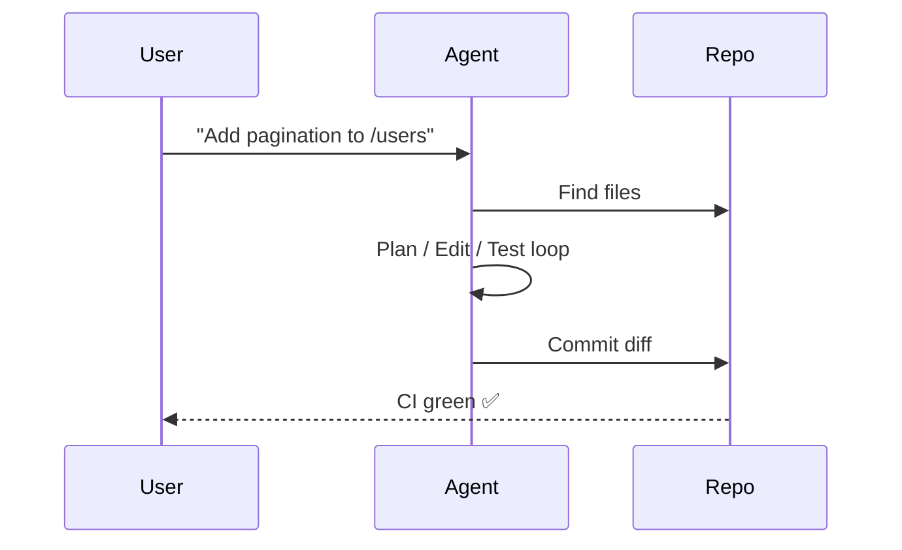

# Cursor Power‑Up

## Master AI‑accelerated development in one sitting

<div class="mt-6 text-sm opacity-75">Press **Space** to begin ⇩</div>

---

# The Productivity Gap

Developers have ⬆️ powerful tools but only **10‑15 %** productivity gains.

* 40 % time lost to context switching & boilerplate
* AI assistants often used as *autocomplete*, not *partner*
* Missed opportunity ≈ **2‑3×** potential speed‑up

**Goal today:** close that gap with a structured Cursor workflow.

---

# Cursor Pillars

### 1 Intelligent Context
Semantic index of your codebase & docs

### 2 Multi‑Model Engine
Pick the right LLM per task → save cost

### 3 Extensible Tooling (MCP)
Run tests, deployments, any CLI straight from chat

---
layout: two-cols
class: gap-8
---

# Project Setup & Settings

- `.cursorignore` → exclude `node_modules/**`, `*.env`, generated files
- Ensure **Embedded your Codebase** (‑40 % tokens)
- Configure default models per task
- Check‑in `cursor-settings.json` so new hires start optimised

::right::

```bash
# first‑run checklist
echo 'node_modules/**' >> .cursorignore
echo '*.env'          >> .cursorignore
```

*Cold‑start latency ↓ **44 %** after proper ignore rules*

---

# Add Docs for Context @Docs

1. Open chat → `@Docs › Add new doc`
2. Paste URL or path (Markdown / PDF)
3. Label e.g. **React‑Docs** , auto‑refresh weekly

> Keep each label < 200 K tokens to fit 8 K context budget

Pitfalls 🛑: huge API dumps & private Confluence without cookie.

---

# Agents 101



Best practices
1. Seed role ✏️: *"Always update tests & run linter"*
2. Max step timeout 90 s
3. Diff‑only commits for easy review

---
layout: two-cols
class: gap-8
---

# Chat Workflow Tips

- ⌘⇧P → inject selection / file
- **3‑Turn refinement**
  1. Design
  2. Skeleton
  3. Fill logic
- Use **Notepads** for persistent project facts

::right::

| Token usage |
| --- | --- |
| Verbose single prompt | 100 % |
| 3‑Turn flow | **62 %** |

---

# MCP Power‑User Guide

| Command | Purpose |
| --- | --- |
| `run_tests` | Run unit tests |
| `deploy_preview` | Build PR preview |
| `get_logs service=auth` | Tail logs |

Secure keys stay in OS keychain; MCP passes env only at runtime.

Debug with `mcp logs --tail` or `--dry-run`.

---

# Embeddings & Model Strategy

| Task | Model | Reason |
| --- | --- | --- |
| Boilerplate | gpt‑3.5‑turbo | cheap & fast |
| Architecture | gpt‑4‑o | high reasoning |
| 30 K context | Claude‑3‑Opus | huge window |

Ada‑002 embeddings ≈ $0.10 / 1M tokens → medium repo costs <$0.01 per index.

---

# Performance Tricks ⚡️

* **Context‑as‑Code**: embed directives in comments for scoped edits
* Ask for *diff patch* not full file → ‑30 % tokens
* Self‑eval prompt: *"Rate answer 1‑5; if <4 rewrite."*

Limitations
- ⬆️200 files per Agent run
- Commands >5 min killed (use background)

---

# Best Coding Patterns

1. **Prompt‑Driven TDD** – write failing test first via chat
2. **Architecture Diary** – notes indexed via @Docs
3. **Micro‑commits** – one intent per diff
4. **Cursor Linter** – "Scan repo for anti‑pattern X" via MCP

---
layout: center
class: text-3xl
---

# Recap → Key Takeaways

🚀 Proper setup & docs → fastest ROI

🤖 Agents + MCP = autonomous coding & DevOps cockpit

💸 Model tiering cuts cost 40‑60 %

🧠 Iterative, chunked prompting compounds productivity

---
layout: center
class: text-center
---

# Thank You!

### Questions?

<div class="mt-6">
  <carbon:logo-github class="inline-block text-2xl" />  github.com/your‑repo
</div> 